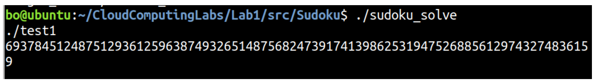
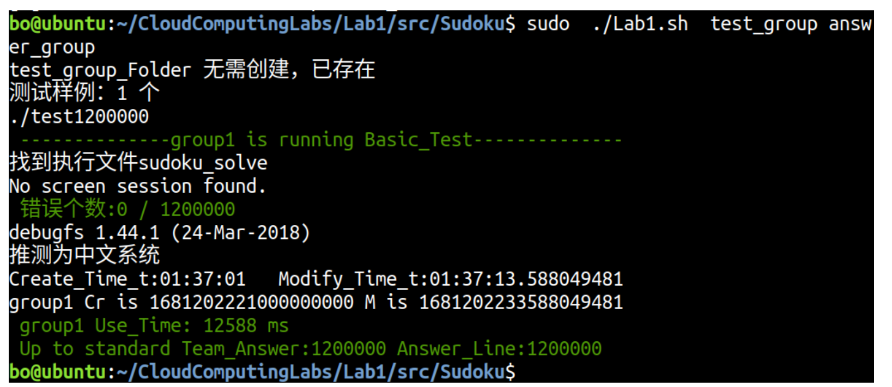

## 1.使用说明

进入目录后输入命令make编译源程序，得到可执行文件`sudoku_solve`，输入命令`./sudoku_solve`可以运行此可执行文件，只需输入文件名即可得到对应的数独问题的解

当需要停止输入时只需按`ctrl+z`退出程序即可

也可以使用脚本文件测试输入文件：

## 2.设计步骤

整体流程为从标准输入读入文件路径，然后读取数独题目并使用多线程求解，并输出结果。

具体执行过程如下：

1. 程序开始运行，初始化变量，包括动态分配二维数组的第一维、标记数组和硬件线程数等等。
2. 在读入文件路径时，如果用户输入了文件路径，则进入循环，并对每个文件路径调用`sudoku_solve()`函数进行数独题目的读取和求解。
3. 在`sudoku_solve()`函数中，程序先打开输入文件，并使用一个布尔类型的变量`end_of_file`记录文件是否读完。然后，程序会循环读入数独题目，每次读取N+1个字符（包括换行符）存储到puzzle数组中，然后将这行数独谜题存入动态分配的二维数组Buf中，并将标记数组Is_Solved中的当前位置标记为false，即尚未求解。
4. 当读取了Mam_Puzzle-1个数独谜题或者读到了文件末尾时，跳出循环。
5. 然后程序通过调用`creat_thread()`函数，将处理过的数独谜题分配给多个线程进行求解，并在所有线程运行完毕后统计结果输出。该函数接收三个参数：step表示每个线程分配到的任务量，curr表示当前任务的起始位置，line_count表示任务总数。程序使用线程数组threads存储所有线程，依次为每个线程分配任务。
6. 在每个线程中，调用`distribute()`函数对任务进行分配。该函数接收两个参数：sta表示起始位置，line_num表示任务长度。该函数的主要作用是调用`solve_sudoku_dancing_links()`函数求解数独谜题，然后将结果存储到标记数组Is_Solved中。
7. 当所有线程运行完毕后，调用`output()`函数输出每个数独谜题的结果。该函数接收一个参数line_count，表示任务总数。程序遍历标记数组Is_Solved，如果当前数独谜题有解，则输出解，否则输出"No result"。
8. 当所有任务都处理完毕后，调用`free_buf()`函数释放动态分配的内存，并结束程序的运行。

## 3.单线程

文件夹目录下还有一个单线程的版本，对于数据集较小的文件可以通过，但当数据很大时会造成超时等问题。